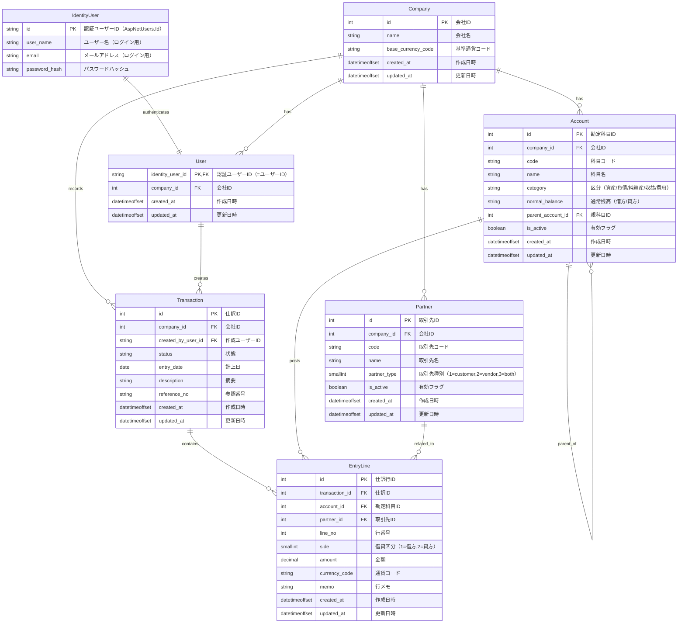

## Constraints (EF Core / PostgreSQL)

MermaidのER図は概念共有が主目的のため、制約・インデックスはEF Coreのモデル設定で表現し、MigrationでDBへ反映する想定。

このリポジトリの現状の実装は PostgreSQL（Npgsql）前提。

- ID: 基本は `uuid`（.NET側は`Guid`）
    - 例外: `transactions.Id` と `entry_lines.Id` は `bigint` の自動採番（.NET側は`long`）
- 日時: `timestamptz`（.NET側は`DateTimeOffset`）
- 日付: `date`（.NET側は`DateOnly`）
- 金額: `numeric(18,2)`（要件に応じて調整）

- 主キー: 各テーブルは`Id`（サロゲートキー）
- 複合主キーは使わず、必要な一意性は複合UNIQUE（ユニークインデックス）で担保

※認証はASP.NET Core Identity（既定の`AspNetUsers`等）を使用する想定。
このドキュメント上の`IdentityUser`は概念表現で、実体はIdentityが作るテーブルを参照する。

### 推奨ユニーク制約（UNIQUE）

- Account: `(CompanyId, Code)` をユニーク
- Partner: `(CompanyId, Code)` をユニーク
- User: `IdentityUserId` はPK（= `AspNetUsers.Id` へのFK）
- EntryLine: `(TransactionId, LineNo)` をユニーク（同一伝票内で行番号重複を防止）

### 推奨チェック制約（CHECK）

- EntryLine.Side: `1 = debit (借方)`, `2 = credit (貸方)`
    - 例: `CHECK ("Side" IN (1, 2))`
- Partner.PartnerType: `1 = customer (得意先)`, `2 = vendor (仕入先/支払先)`
        - 例: `CHECK ("PartnerType" IN (1, 2))`
- EntryLine.Amount: 0より大きい前提なら `CHECK ([Amount] > 0)`
  - 返品/訂正などでマイナスを許す設計なら、この制約は付けない

### 推奨インデックス

- Transaction: `(CompanyId, EntryDate)`（期間検索・月次表示）
- EntryLine: `(AccountId)`（勘定元帳/科目別集計）
- EntryLine: `(PartnerId)`（取引先別集計を多用する場合）

### Account階層の運用ルール

- `Account.parent_account_id` により科目階層を表現（1テーブル自己参照）
- 階層の最大深さは3（ルート=1、子=2、孫=3）
    - DB制約で表現しにくいため、アプリ側（EF Coreのサービス層/ドメイン層）で検証
    - 併せて循環（A→B→Aなど）もアプリ側で禁止
- 科目の「親の付け替え（移動）」は未使用の場合のみ許可
    - 未使用=その科目を参照する`EntryLine`が0件
    - 使用済みの場合は移動不可とし、必要なら新科目を作成して旧科目を`is_active=false`で無効化する

### PostgreSQL向けの型（例）

- 金額: `numeric(18,2)`（要件に応じて調整）
- 日時: `timestamptz`（UTC/タイムゾーン対応をしたい場合）

### UTC/タイムゾーン運用メモ

- .NET側の型は`DateTimeOffset`を推奨（オフセットを保持できる）
- DBには`datetimeoffset`で保存し、運用としてはUTCで統一する（表示時にローカルへ変換）
- DB既定値を使う場合は`now()`を使用